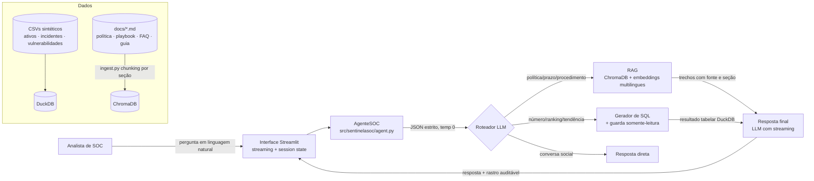

# Arquitetura — SentinelaSOC

## Visão geral

O SentinelaSOC é um copiloto de chat para analistas de SOC. Cada pergunta passa por
um roteador que decide, de forma auditável, entre duas fontes de verdade — documentos
internos (RAG) e dados operacionais (SQL analítico) — antes de compor a resposta final.

## Decisões de arquitetura (ADRs informais)

| # | Decisão | Alternativas consideradas | Por quê |
|---|---------|---------------------------|---------|
| 1 | **Roteador explícito em JSON** antes das ferramentas | function-calling nativo do provedor; RAG sempre ligado | Funciona com **qualquer** provedor OpenAI-compatível (OpenRouter, Groq, Ollama, vLLM), é determinístico (temp 0) e gera rastro auditável por design |
| 2 | **DuckDB** para a camada analítica | SQLite; Postgres | Colunar, queries analíticas (agregações, janelas) em SQL padrão sobre CSVs, zero infraestrutura, embedded |
| 3 | **ChromaDB + sentence-transformers** para o RAG | txtai; FAIR; Qdrant | Persistência local trivial, metadados por chunk (fonte/seção) para citação, API estável; benchmark do golden set orienta o modelo (ver `evals/`) |
| 4 | **Chunking por seção markdown** (## e ###) com quebra secundária ~900 chars | chunk fixo por caracteres | Preserva a semântica do documento: cada playbook de incidente vira um chunk citável ("Playbook, seção 5.1") |
| 5 | **Injeção de dependência do cliente LLM** (Protocol `LLMClient`) | singleton acoplado à OpenAI | Testes unitários do agente sem rede (FakeLLM), troca de provedor por variável de ambiente |
| 6 | **Guarda de SQL no código, não no prompt** | confiar na instrução "somente SELECT" do prompt | Prompt é sugestão; código é garantia. Validação por regex + lista de bloqueio antes de tocar o banco, com teste dedicado |
| 7 | **Trace de execução em toda resposta** | resposta opaca | Auditoria (que ferramenta, qual SQL, quais fontes, tempos) exibida na UI e essencial para depurar respostas erradas |
| 8 | **Memória em 3 camadas (SQLite)** | estado só em sessão; vetorstore como memória | Episódica (conversas retomáveis) + semântica (fatos do analista, com teto/dedup e visíveis/apagáveis). Local, sem serviço externo |
| 9 | **Reescrita de seguimentos antes de rotear** | passar o histórico cru às ferramentas | Follow-ups viram perguntas autônomas (auditáveis no trace) antes de SQL/RAG — padrão consolidado de RAG conversacional |
| 10 | **Recuperação híbrida (vetores + BM25, fusão RRF)** | apenas vetores | Embeddings borram identificadores exatos (T1566, '15/2024', KEV); BM25 cobre o léxico e a fusão reciprocal rank soma os dois (hit@1 93%→100% no golden ampliado). Índice lazy espelhado do ChromaDB, degradação graciosa |
| 11 | **ML como ferramenta determinística do roteador** (`ml`) | LLM "prever" na resposta final; endpoint de modelo separado | O classificador (scikit-learn, artefato joblib regenerável por seed) roda local e determinístico; o LLM só interpreta. Filtro por tipo/severidade/ambiente é casamento lexical sem LLM (auditável), e a métrica do modelo acompanha a resposta — o teto de Bayes do rótulo é publicado em `evals/report_ml.md` para separar modelo fraco de problema ruidoso |

## Modelo de dados

Três tabelas relacionadas (`ativo_id` como chave estrangeira), geradas de forma
determinística (seed fixa) por `scripts/generate_data.py`:

- `ativos` (40) — catálogo de ativos: ambiente (DMZ/Produção/Homologação), criticidade, exposição à internet
- `incidentes` (356) — 8 tipos mapeados a táticas MITRE ATT&CK, severidade, status, tempo de resolução e **rótulo de falso positivo** (prepara o ground truth para um classificador futuro)
- `vulnerabilidades` (118) — CVE, CVSS, SLA de correção por pontuação, status

Distribuições são intencionalmente enviesadas para refletir realidade de SOC
(expostos em DMZ concentram mais incidentes; falsos positivos correlacionam com
severidade baixa), tornando consultas analíticas interessantes.

## Segurança — modelo de ameaças

Ativos a proteger: o banco DuckDB (integridade), os documentos internos (sigilo),
a chave de API do provedor (sigilo) e o analista (engano via conteúdo injetado).

| Ameaça | Vetor | Mitigação implementada |
|--------|-------|------------------------|
| **Escrita/exfiltração via NL→SQL** | pergunta induz LLM a gerar `DELETE`/`UPDATE`/`COPY TO`/`ATTACH` | `validar_sql()` rejeita tudo que não é `SELECT`/`WITH` único, com lista de bloqueio de verbos e funções perigosas; subconsulta com `LIMIT` forçado; testes parametrizados em `tests/test_db.py` |
| **SQL injection convencional** | aspas/ponto-e-vírgula na pergunta | SQL é **gerado**, não concatenado; ponto-e-vírgula e múltiplos statements bloqueados pelo guarda |
| **Prompt injection via documento** | texto malicioso dentro de chunk recuperado | Escopo assumido: corpus é interno e versionado no repo; o system prompt determina que conteúdo recuperado é **dado, não instrução**, e proíbe revelar credenciais/ensinar ataques |
| **Vazamento de segredos** | chave de API hardcoded ou commitada | Configuração 12-factor via `.env` (`python-dotenv`/`pydantic-settings`), `.env` no `.gitignore`, `.env.example` como contrato |
| **Exposição de dados pessoais** | relatórios com dados de titulares | System prompt restringe a exibição a dados agregados/anonimizados (LGPD); corpus não contém dados reais |
| **Abuso do orçamento de LLM** | loop de chamadas | Máx. 1 chamada de roteamento + 1 por ferramenta + 1 resposta; retry com backoff limitado (`llm_max_retries`) |

Limitações assumidas (honestidade do projeto): não há autenticação de usuário na UI
(é uma ferramenta de mesa do analista, não um serviço multi-tenant); o corpus é
sintético; o juiz de fidelidade da resposta final ainda não está automatizado no
harness de avaliação (a avaliação atual mede a recuperação, gargalo dominante).

## Avaliação

`evals/evaluate.py` roda o golden set (12 perguntas reais de triagem) contra índices
temporários por modelo de embeddings e reporta hit@1, hit@3, MRR e distância média
do top-1 (`evals/report.md`). A escolha do modelo padrão é **orientada por dados**,
não por moda: o MiniLM multilingue venceu o e5-small no golden set com um quarto do
tamanho. Em produção a recuperação usa top-4, e ambos os modelos avaliados atingem
100% de hit@3 — o chunk correto sempre alcança o contexto do LLM.

## Observabilidade

- Logging estruturado por módulo (`telemetry.py`), níveis via `LOG_LEVEL`.
- Cada resposta carrega um trace com tempos por etapa (roteamento, ferramenta, SQL),
  exibido na UI no painel "Rastro da resposta" — latência e custo de cada camada
  ficam visíveis para o analista e para o desenvolvedor.
