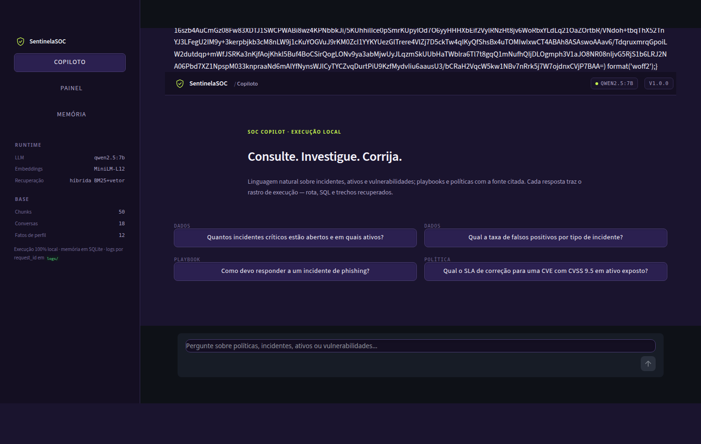
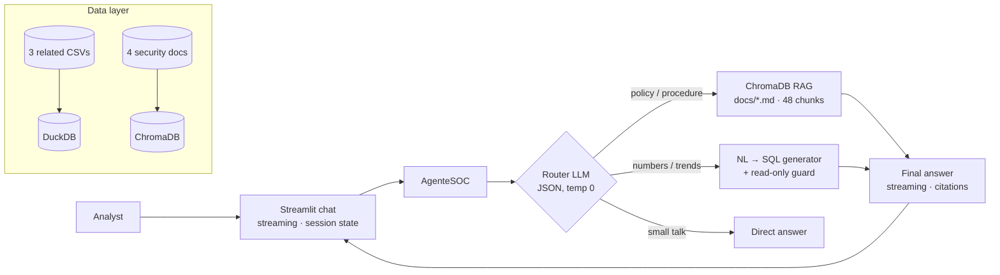

# 🛡️ SentinelaSOC

**AI copilot for Security Operations Centers** — answers analyst questions from internal
security documentation (RAG) and from operational incident data (natural language → SQL),
with an auditable tool trace on every response.

[](https://www.python.org)
[](LICENSE)
[](https://github.com/astral-sh/ruff)
[](https://github.com/oness24/sentinelasoc/actions/workflows/ci.yml)

> Interface em português do Brasil; código e documentação técnica em inglês/português.



---

## Why

SOC analysts drown in two kinds of friction: finding **what the policy says** (scattered
PDFs, wikis, tribal knowledge) and querying **what the data says** (SQL they shouldn't
need to write mid-incident). SentinelaSOC collapses both into one chat: it routes each
question to the right source of truth — semantic search over the security document set,
or a validated read-only SQL query over the incident database — and answers with
citations, streaming, and a full audit trail of which tools ran and why.

## What it does

| Analyst asks (pt-BR) | Router picks | SentinelaSOC answers with |
|---|---|---|
| "Qual o prazo para comunicar a ANPD em incidente com dados pessoais?" | RAG | Playbook §5.5/§7 — 2 dias úteis (Resolução CD/ANPD 15/2024), citing document + section |
| "Quantos incidentes críticos estão abertos e em quais ativos?" | SQL | Generated DuckDB query over `incidentes ⋈ ativos`, summarized |
| "Qual o SLA de correção para uma CVE com CVSS 9.5 em ativo exposto?" | RAG + SQL | Guia de Gestão §3 (7 dias) **and** how many such CVEs are currently open |
| "Apague todos os incidentes" | SQL (blocked) | Read-only guard rejects it; response explains the policy |

Every answer ships with a **trace panel**: the routing decision, the exact SQL executed
and row count, the retrieved document sections with similarity distances, and per-stage
latency. No black-box answers.

## Architecture



Full decisions, data model and **threat model** in [ARCHITECTURE.md](ARCHITECTURE.md).

Stack: **Python 3.11+ · Streamlit · DuckDB · ChromaDB · sentence-transformers ·
OpenAI-compatible LLM API** (OpenAI, OpenRouter, Groq, Ollama, vLLM — anything that
speaks the OpenAI protocol).

## Quickstart

### Local

```bash
git clone https://github.com/oness24/sentinelasoc && cd sentinelasoc
make install                # venv + deps (CPU torch)
cp .env.example .env        # defaults point to a local Ollama instance
ollama pull qwen2.5:7b        # any chat model works — see `ollama list`
make ingest                 # index docs/ into ChromaDB
make run                    # → http://localhost:8501
```

### Docker

```bash
cp .env.example .env        # defaults point to local Ollama
# No .env, troque a base URL para alcançar o Ollama do host:
#   OPENAI_BASE_URL=http://host.docker.internal:11434/v1
docker compose up --build   # → http://localhost:8501
```

The image bakes the vector index and embedding model at build time — no cold-start
download on first question.

## Configuration (`.env`)

| Variable | Default | Purpose |
|---|---|---|
| `OPENAI_API_KEY` | `ollama` | Placeholder for local Ollama; real key for cloud providers |
| `OPENAI_BASE_URL` | `http://localhost:11434/v1` | Ollama by default; point to OpenAI/OpenRouter/Groq/vLLM when needed |
| `LLM_MODEL` | `qwen2.5:7b` | Any model available in `ollama list`, or a cloud model name |
| `EMBED_MODEL` | `paraphrase-multilingual-MiniLM-L12-v2` | Embedding model (e5 family supported; prefixes handled automatically) |
| `RETRIEVAL_K` | `4` | Chunks retrieved per query |
| `LOG_LEVEL` | `INFO` | Logging |

## Memory & personalization

The copilot keeps three layers of memory, all local (SQLite — `sentinelasoc.db`):

| Layer | What | Where you see it |
|---|---|---|
| Working | last 6 turns of the current chat | conversation itself |
| Episodic | full conversations with audit traces, resumable | sidebar "Conversas" + export to `.md` |
| Semantic | durable facts about the analyst (role, focus areas, answer preferences), extracted every 2 exchanges, capped at 12, deduplicated | sidebar "Memória do analista" — fully visible and erasable |

Follow-ups work conversationally: questions like *"e só os do Financeiro?"* are rewritten into
standalone queries using dialog context before routing, and the SQL generator sees the
conversation history. Rewrites appear in the audit trace (`ctx` row) and in the logs
(`rewrite.done`).

## Evaluation (measured, not vibes)

`make eval` runs a 12-question golden set of real triage questions against temporary
per-model indexes (`evals/golden.json`, `evals/report.md`):

| Embedding model | hit@1 | hit@3 | MRR | size |
|---|---|---|---|---|
| `paraphrase-multilingual-MiniLM-L12-v2` **(default)** | **92%** | 100% | **0.96** | 118 MB |
| `intfloat/multilingual-e5-small` | 83% | 100% | 0.92 | 470 MB |

The default model was chosen by this benchmark — smaller, faster and more accurate on
the golden set. Both reach 100% hit@3, and production retrieves top-4, so the correct
chunk always reaches the LLM context.

## Security

- **Read-only SQL guard in code, not prompt**: anything that isn't a single
  `SELECT`/`WITH` is rejected before touching DuckDB (DELETE/DROP/UPDATE/COPY/ATTACH
  and friends) — parameterized tests in `tests/test_db.py`.
- **Secrets 12-factor**: keys only via `.env`; `.env` never committed.
- **System prompt hardening**: refuses credential disclosure, attack guidance and
  deanonymized personal data (LGPD); retrieved content is treated as data, not
  instructions.
- **Full audit trail**: routing decision, SQL, sources and timings recorded per answer.
- **Data is synthetic and deterministic** (seeded generator) — no real PII possible.

Threat model with attack vectors and mitigations: [ARCHITECTURE.md](ARCHITECTURE.md#segurança--modelo-de-ameaças).

## Repository

```
├── app.py                    # Streamlit entrypoint (thin)
├── ingest.py                 # CLI: index docs/ into ChromaDB
├── src/sentinelasoc/         # typed package (agent, db, rag, llm, prompts, settings, telemetry)
├── data/                     # 3 related CSVs (synthetic, seeded)
├── docs/                     # security corpus: policy, IR playbook, triage FAQ, vuln mgmt guide
├── evals/                    # golden set + evaluation harness + report
├── tests/                    # pytest: unit (FakeLLM, no network) + integration markers
├── scripts/generate_data.py  # deterministic synthetic data generator
├── docker/ · docker-compose.yml · .github/workflows/ci.yml · Makefile
```

## Testing & CI

```bash
make test          # unit — 28 tests, no network, no keys (FakeLLM via DI)
make test-all      # + integration (embeddings, index) — 37 total
make lint typecheck  # ruff + mypy
```

CI (GitHub Actions): ruff format/check, mypy, unit tests on every push/PR; integration
job runs the RAG suite locally-seeded.

## Roadmap

- [ ] False-positive classifier for incident triage (labels already in `incidentes.csv`)
- [ ] Autonomous agents: ticket actions and analyst notifications
- [ ] LLM-as-judge faithfulness scoring in the eval harness
- [ ] Hybrid retrieval (BM25 + vectors) and reranking
- [ ] Optional auth layer (OIDC) for multi-user deployments

## License

[MIT](LICENSE)
